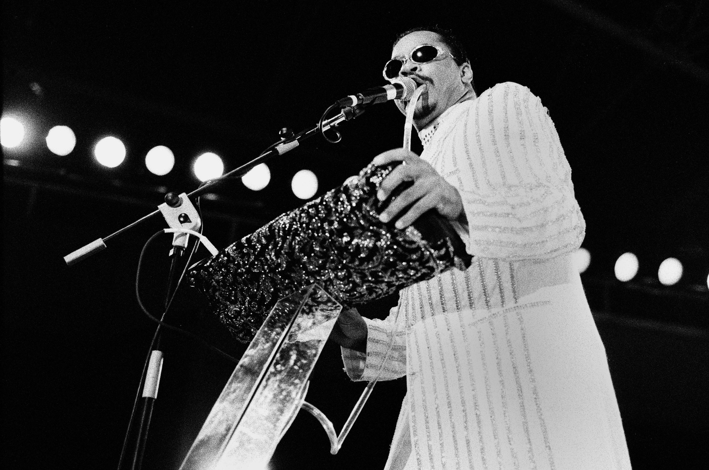

# Vocal FX

## Talk box

The Talk box is an electromechanical device. This is how it works:

1. A signal is sent to a speaker driver
1. The speaker is connected to a plastic tube.
1. The sound waves travel up the tube into the person's mouth.
1. Their mouth acts as a filter, changing the frequency content of the sound.
1. The sound comes out of the person's mouth and is captured with a mic.

{}

## Vocoder

### Summary

A vocoder synthesises speech. It analyses a 'modulation' signal (speech) and uses this to apply filters to the 'carrier' signal (a synthesiser output).

A vocoder can sound more realistic by increasing the number of filter bands.

### Examples

Bob Moog and Wendy Carlos developed an early vocoder for *Clockwork Orange* (1970).

The vocoder was popular in the late 1970s and early 1980s:

* ELO: 'Mr Blue Sky' (1977)
* Kraftwerk: ['The Robots'](https://www.youtube.com/watch?v=D_8Pma1vHmw#t=65s) (1978)

### Quick Logic tutorial

<iframe width="560" height="315" src="https://www.youtube.com/embed/wM7yftkjvuw" frameborder="0" allow="accelerometer; autoplay; encrypted-media; gyroscope; picture-in-picture" allowfullscreen></iframe>

